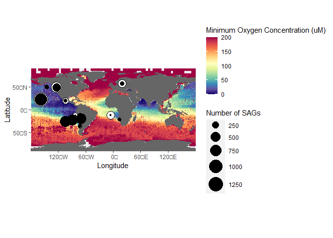
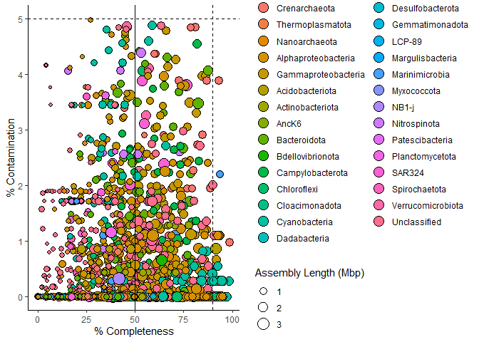
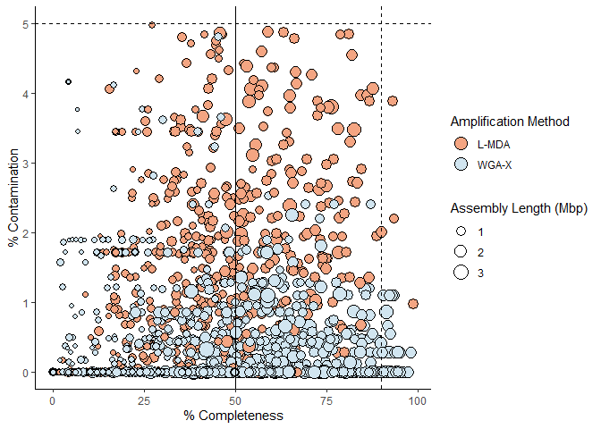
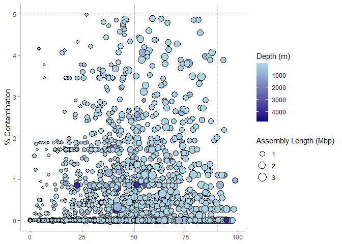
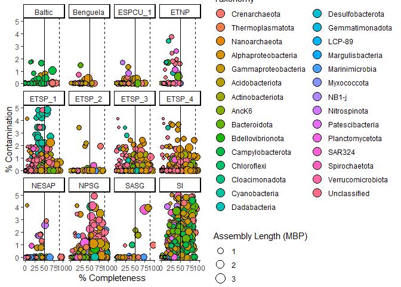
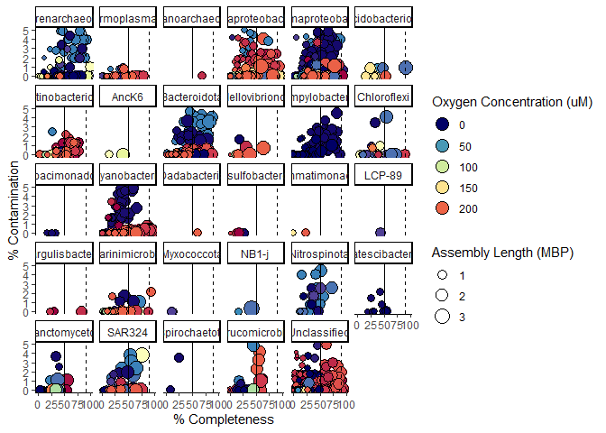
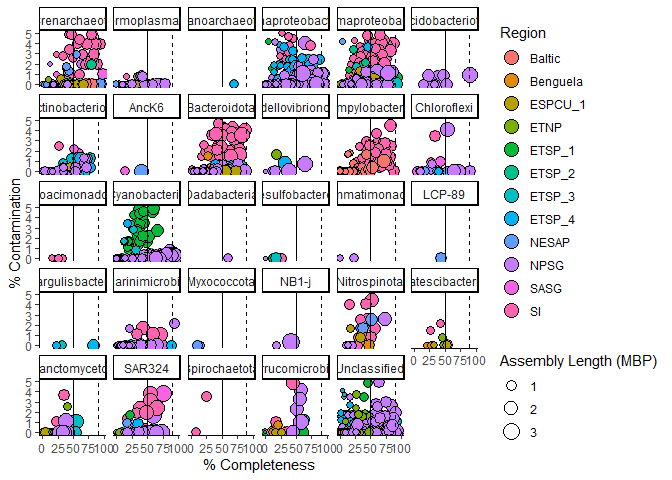

OMZ Compendium Figures And Tables
================
Julia Anstett
2022-08-11

First, we will import the libraries used to generate all figures for
this paper

``` r
library(tidyverse)
```

    ## -- Attaching packages --------------------------------------- tidyverse 1.3.1 --

    ## v ggplot2 3.3.5     v purrr   0.3.4
    ## v tibble  3.1.6     v dplyr   1.0.8
    ## v tidyr   1.2.0     v stringr 1.4.0
    ## v readr   2.1.2     v forcats 0.5.1

    ## -- Conflicts ------------------------------------------ tidyverse_conflicts() --
    ## x dplyr::filter() masks stats::filter()
    ## x dplyr::lag()    masks stats::lag()

``` r
library(vegan)
```

    ## Loading required package: permute

    ## Loading required package: lattice

    ## This is vegan 2.5-7

``` r
library(dendextend)
```

    ## Registered S3 method overwritten by 'dendextend':
    ##   method     from 
    ##   rev.hclust vegan

    ## 
    ## ---------------------
    ## Welcome to dendextend version 1.15.2
    ## Type citation('dendextend') for how to cite the package.
    ## 
    ## Type browseVignettes(package = 'dendextend') for the package vignette.
    ## The github page is: https://github.com/talgalili/dendextend/
    ## 
    ## Suggestions and bug-reports can be submitted at: https://github.com/talgalili/dendextend/issues
    ## You may ask questions at stackoverflow, use the r and dendextend tags: 
    ##   https://stackoverflow.com/questions/tagged/dendextend
    ## 
    ##  To suppress this message use:  suppressPackageStartupMessages(library(dendextend))
    ## ---------------------

    ## 
    ## Attaching package: 'dendextend'

    ## The following object is masked from 'package:permute':
    ## 
    ##     shuffle

    ## The following object is masked from 'package:stats':
    ## 
    ##     cutree

``` r
library(sf)
```

    ## Linking to GEOS 3.9.1, GDAL 3.2.1, PROJ 7.2.1; sf_use_s2() is TRUE

``` r
library("rnaturalearth")
library("rnaturalearthdata")
library(egg)
```

    ## Loading required package: gridExtra

    ## 
    ## Attaching package: 'gridExtra'

    ## The following object is masked from 'package:dplyr':
    ## 
    ##     combine

Next, we will import the data used to generate all files in this paper

``` r
#All figures use OMZ
OMZ<-read.csv("Data/Update_Global_SAGs_Aug_05_2022_GTDB.csv", header = TRUE)

#Figures 3, 4, S2-6 use the truncated Phylum labels for ploting
Tax_list_labs<-read.csv("Data/Tax_List_Labs_Sept_23_2021.csv", header = FALSE)

#For Figure 1B
oxygen1<-read.csv("Data/woa18_all_o00mn01.csv", header = TRUE)
oxygen5<-read.csv("Data/woa18_all_o00mn5d.csv", header = TRUE)


#For Figure 3
CD_Hits<-read.csv("Data/CD-Hit_OTUS_July_05_2022.csv", header= TRUE)
SSU_Seqs<-read.csv("Data/SSU_Seqs.csv", header = TRUE)
```

\###Figures

## Figure 1B

Here, I will make the map with the OMZ Counts

``` r
#First, we'll round up the Latitude and Longitide to the nearest degree
OMZ<- OMZ %>% mutate(Round_Lat=round(OMZ$Lat))
OMZ<- OMZ %>% mutate(Round_Long=round(OMZ$Long))

plot_points<-OMZ %>% select(Region,Round_Lat, Round_Long)
plot_points<-unique(plot_points)


counter<-1
for (i in 1:dim(plot_points)[1]){
  input<-tally(OMZ %>% filter (Region==plot_points[i,1],Round_Lat==plot_points[i,2], Round_Long==plot_points[i,3]))
  plot_points[counter,4]<-input
  counter<- counter+1 
}

colnames(plot_points)[4]<-"Total"

counter<-1
for (i in 1:dim(plot_points)[1]){
  input<-tally(OMZ %>% filter (Region==plot_points[i,1],Round_Lat==plot_points[i,2], Round_Long==plot_points[i,3], Status=="Sequenced"))
  plot_points[counter,5]<-input
  counter<- counter+1 
}

colnames(plot_points)[5]<-"Sequenced"

min_O2_1_test<-oxygen1 %>% select(-LATITUDE, -LONGITUDE)
min_O2_5_test<-oxygen5 %>% select(-LATITUDE, -LONGITUDE)


min_O2_1<-oxygen1 %>% select(LATITUDE, LONGITUDE) %>% mutate(uM=apply(min_O2_1_test, 1, FUN=min, na.rm=TRUE))
min_O2_plot_1<-min_O2_1%>% mutate(uM=replace(min_O2_1$uM, min_O2_1$uM>=200, 200))


min_O2_5<-oxygen5 %>% select (LATITUDE, LONGITUDE) %>% mutate(uM=apply(min_O2_5_test, 1, FUN=min, na.rm=TRUE))
min_O2_plot_5<-min_O2_5%>%mutate(uM=replace(min_O2_5$uM, min_O2_5$uM>=200, 200))


rainbow1<-c('#9e0142','#d53e4f','#f46d43','#fdae61','#fee08b','#ffffbf','#e6f598','#abdda4','#66c2a5','#3288bd','#5e4fa2', '#000066')
revrainbow1<-rev(rainbow1)

mp <- NULL


world <- ne_countries(scale = "medium", returnclass = "sf")


colnames(plot_points)[2]<-"Latitude"
colnames(plot_points)[3]<-"Longitude"

sites<-plot_points
sites <- st_as_sf(sites, coords = c("Longitude", "Latitude"), 
                  crs = 4326, agr = "constant")

sf_use_s2(FALSE)
```

    ## Spherical geometry (s2) switched off

``` r
#mapWorld <- borders("world", colour="grey40", fill="grey40") # create a layer of borders
mp <- ggplot() +

  
  geom_raster(aes(x=min_O2_plot_5$LONGITUDE, y=min_O2_plot_5$LATITUDE, fill=min_O2_plot_5$uM)) +
  geom_raster(aes(x=min_O2_plot_1$LONGITUDE, y=min_O2_plot_1$LATITUDE, fill=min_O2_plot_1$uM)) +
  scale_fill_gradientn(colours =revrainbow1, name="Minimum Oxygen Concentration (uM)")+
  
  geom_sf(data=world, color = "grey40", fill = "grey40") +
  
  
  geom_sf(data = sites, aes(size = sites$Total), shape = 21, fill = "white") +  
  geom_sf(data = sites, aes(size = sites$Sequenced), shape = 21, fill = "black") +
  scale_size(range = c(1, 10))+
  labs(size="Number of SAGs")+
  geom_sf()+
  coord_sf(expand = FALSE) + 
  xlab("Longitude") + 
  ylab("Latitude")

mp
```

<!-- -->

``` r
ggsave("Outputs/FIG-1B-OMZ_Map.pdf",mp, width=15, height = 14, units = "in")
```

## Figure 3A

This will produce the dendrogram and the clustering annotation bars.

``` r
#First, we need to convert the CD-Hit table to a readable and assign a cluster ID to each SSU sequence
counter<-0
start_ID<-0
for (i in 1:dim(CD_Hits)[1]){
  tmp<-CD_Hits$Cluster_ID[i]
  
  if (tmp==counter){
    CD_Hits$Cluster_ID[i]<-paste("Cluster", start_ID, sep="_")
    
  }else{
    counter<-0
    start_ID<-start_ID+1
    CD_Hits$Cluster_ID[i]<-paste("Cluster", start_ID, sep="_")
  }
  counter<-counter+1
}

#Variable Declaration so we can get ready to get the proportions of the amplified and sequenced representatives used in the distance matrix
props_Amp<-data.frame()
props_Seq<-data.frame()

props_Amp_WGS<-data.frame()
props_Amp_SSU<-data.frame()

SSU_plot<-data.frame()

#Grab all of the unique SILVA 138.1 taxonomies
Tax_list<-unique(OMZ %>% select(SILVA_138_1_Tax) %>% arrange (SILVA_138_1_Tax))

#Reduce the dataset
wga_apporach<-OMZ%>% select(Site_ID, O2._.uM., WGA_Approach, Sorting_Method, OMZ_Phenotype, Topography)
wga_apporach_DNA_Only<-wga_apporach %>% filter(Sorting_Method=="DNA")
wga_apporach_DNA_Only<-wga_apporach_DNA_Only %>%  distinct(Site_ID, .keep_all = TRUE)


#Variable Declaration to get ready to plot and count

Plot_labs<-c()


OMZ_Counts_Amp<-data.frame()
OMZ_Counts_Seq<-data.frame()

OMZ_plot<-data.frame()


#Set up the Taxonomy List


for (i in 1: dim(OMZ)[1]){
  for (j in 1:dim (Tax_list_labs)[1]){
    pattern<-as.character(Tax_list_labs[j,1])
    tmp_match<-grepl(pattern, as.character(OMZ$SILVA_138_1_Tax[i]))
    
    if (tmp_match==TRUE){
      OMZ$Plot_Taxa[i]<-pattern
    }
  }
}


#Next, we're going to subset for the anonymously sorted SAGs, and exclude SAGs that did not cover the SSU rRNA V4-V5 region, as well as
#any unclassified SAGs

DNA_Sorted<- OMZ %>% filter(Sorting_Method=="DNA")
DNA_Sites<- as.character(unique(DNA_Sorted$Site_ID))
SSU_DNA_Only<-DNA_Sorted %>% filter(Primary_Tax_Method=="16S", Target_Region!="V6-V8", SILVA_138_1_Tax !="Unclassified")
SSU_Sites<- as.character(unique(SSU_DNA_Only$Site_ID))


#This brings in the appropriate cluster IDs
for (i in 1:dim(SSU_DNA_Only)[1]){
  pattern<-as.character(SSU_DNA_Only$Sample_ID[i])
  tmp_match<- CD_Hits %>% filter (Sample_ID==as.character(pattern))
  SSU_DNA_Only$Cluster_ID[i]<-tmp_match$Cluster_ID
    
}

#Here, we're going to identify and record all of the representative SAGs for each cluster
OTU_Reps_Phylum<-data.frame()

OTU_Reps_Phylum<-CD_Hits %>% filter(Identity=="*")


cluster_names<-c()
counter<-1
for (i in 1:dim(OTU_Reps_Phylum)[1]){
    pattern<-as.character(OTU_Reps_Phylum$Sample_ID[i])
    tmp_match<- DNA_Sorted %>% filter(Sample_ID==pattern)
    
    OTU_Reps_Phylum[i,4]<-as.character(tmp_match$SILVA_138_1_Tax)
    OTU_Reps_Phylum[i,5]<-as.character(tmp_match$Plot_Taxa)
 
}

colnames(OTU_Reps_Phylum)[4]<-"SILVA_138_1_Tax"
colnames(OTU_Reps_Phylum)[5]<-"Phylum"

OTU_Reps_Phylum<-OTU_Reps_Phylum %>% filter(SILVA_138_1_Tax!="Unclassified")

SSU_Seqs_Rep<-data.frame()

for (i in 1:dim(OTU_Reps_Phylum)[1]){
  tmp_SSU_Seqs_Rep<-SSU_Seqs %>% filter(Sample_ID==as.character(OTU_Reps_Phylum$Sample_ID[i]))
  SSU_Seqs_Rep<-rbind(SSU_Seqs_Rep,tmp_SSU_Seqs_Rep)
}

write.csv(SSU_Seqs_Rep, "Outputs/SSU_Reps_August_10_2022.csv")
SSU_wga_apporach_DNA_Only<-SSU_DNA_Only %>%  distinct(Site_ID, .keep_all = TRUE)

SSU_Clusters<-unique(SSU_DNA_Only$Cluster_ID)

#######################################################################################################


#calculate amplifed 16S abundances for Full Taxonomy
for (i in 1:dim(Tax_list)[1]){
  for (j in 1: length(SSU_Sites)){
    input<-tally(SSU_DNA_Only %>% filter (SILVA_138_1_Tax==Tax_list[i,1], Site_ID==SSU_Sites[j]))/
      tally (SSU_DNA_Only %>% filter (Site_ID==SSU_Sites[j]))
    props_Amp_SSU[j,i]<-input
  }
} 


rownames(props_Amp_SSU)<-SSU_Sites
colnames(props_Amp_SSU)<-Tax_list[,1]


props_Amp_SSU_OTU<-data.frame()
OTU_List<-unique(SSU_DNA_Only$Cluster_ID)


#calculate amplifed 16S abundances for Full Taxonomy
for (i in 1:length(OTU_List)){
  for (j in 1: length(SSU_Sites)){
    input<-tally(SSU_DNA_Only %>% filter (Cluster_ID==OTU_List[i], Site_ID==SSU_Sites[j]))/
      tally (SSU_DNA_Only %>% filter (Site_ID==SSU_Sites[j]))
    props_Amp_SSU_OTU[j,i]<-input
  }
} 


rownames(props_Amp_SSU_OTU)<-SSU_Sites
colnames(props_Amp_SSU_OTU)<-OTU_List


################################################################################3
#Cluster By OTU Cluster

#################################################################
dist_SSU_prop_bray_otu<-vegdist(props_Amp_SSU_OTU, method = "bray")
clust_SSU_prop_bray_a_otu<-hclust(dist_SSU_prop_bray_otu, method="average")

dend1<-(rotate(as.dendrogram(clust_SSU_prop_bray_a_otu), order = c(1:7,18:34, 16:17 ,8:15)))

#Set Annotation Bar for Oxytype
strip_labels<-labels(dend1)
wga_colors<-c()
phenotype_colours<-c()

#calculate amplifed 16S abundances for Full Taxonomy
for (j in 1: length(strip_labels)){
  y<-SSU_wga_apporach_DNA_Only %>% filter(Site_ID==strip_labels[j]) 
  
  tmp_wga_approach<-as.character(y$WGA_Approach)
  
  
  wga_colors<-c(wga_colors, tmp_wga_approach)
  phenotype_colours<-c(phenotype_colours, as.character(y$OMZ_Phenotype))
  
  
}

wga_colors<-replace(wga_colors, wga_colors=="MDA", "#f4a582")
wga_colors<-replace(wga_colors, wga_colors=="WGA-X", "#d1e5f0")

phenotype_colours<-replace(phenotype_colours, phenotype_colours=="Open_Ocean_OMZ", "#ffffb3")
phenotype_colours<-replace(phenotype_colours, phenotype_colours=="Low_Oxygen_OMZ", "#fccde5")
phenotype_colours<-replace(phenotype_colours, phenotype_colours=="AMZ", "#8dd3c7")
phenotype_colours<-replace(phenotype_colours, phenotype_colours=="Sulfidic_Bottom", "#bebada")

plot_colours<-cbind(phenotype_colours, wga_colors)

pdf("Outputs/FIG-3A_Dend_avg_Aug_10_2022.pdf", width = 15, height = 5)
par(mar = c(15,4,1,1))
plot(dend1)
colored_bars(colors = plot_colours, dend=dend1, sort_by_labels_order = FALSE)
dev.off()
```

    ## png 
    ##   2

\##Figure 3B Dot Plot for anonymously sorted SSU Samples

``` r
#Since we've already clustered our data, we simply need the order the order from the clustering for the sites, the taxonomic labels, 
#and the count data

SSU_Tax_labs<-as.data.frame(unique(SSU_DNA_Only$Plot_Taxa))
colnames(SSU_Tax_labs)<-"Plot_Taxa"

Taxa_to_drop<-c()

for (i in 1:dim(Tax_list_labs)[1]){
  tmp_tax<-Tax_list_labs[i,1]
  tmp_ssu_tax<-SSU_Tax_labs %>% filter (Plot_Taxa==as.character(tmp_tax))
  
  if (dim(tmp_ssu_tax)[1]==0){
    Taxa_to_drop<-append(Taxa_to_drop,as.character(tmp_tax))
  }
}

colnames(Tax_list_labs)<-"Plot_Taxa"
Tax_list_labs<-Tax_list_labs[Tax_list_labs!=Taxa_to_drop,]
Tax_list_labs<-as.vector(Tax_list_labs)
Tax_list_labs<-Tax_list_labs[!Tax_list_labs %in% Taxa_to_drop]

#calculate amplifed 16S abundances for Taxonomy at Phylum Level
counter<-1
for (i in 1:length(Tax_list_labs)){
  for (j in 1: length(SSU_Sites)){
    input<-tally(SSU_DNA_Only %>% filter (Plot_Taxa==as.character(Tax_list_labs[i]), Site_ID==as.character(SSU_Sites[j])))
    
    SSU_plot[counter,1]<-as.character(SSU_Sites[j])
    SSU_plot[counter,2]<-as.character(Tax_list_labs[i])
    SSU_plot[counter,3]<-NA
    SSU_plot[counter,4]<-input
    
    
    counter<-counter+1 
  }
}

oxytype_ssu<-SSU_DNA_Only%>%  distinct(Site_ID, .keep_all = TRUE)


for (i in 1:length(Tax_list_labs)){
  for (j in 1: length(SSU_Sites)){
    
    input<-tally(SSU_DNA_Only %>% filter (Plot_Taxa==Tax_list_labs[i], Site_ID==as.character(SSU_Sites[j]), Status=="Sequenced"))
    
    SSU_plot[counter,1]<-SSU_Sites[j]
    SSU_plot[counter,2]<-Tax_list_labs[i]
    SSU_plot[counter,3]<-oxytype_ssu$O2._.uM.[j]
    SSU_plot[counter,4]<-input
    
    counter<- counter+1 
  }
}

colnames(SSU_plot)<-c("Site", "Taxonomy", "O2_uM", "Count")
SSU_plot$Count[SSU_plot$Count==0]<-NA

SSU_plot<-SSU_plot%>%mutate(O2_uM=replace(SSU_plot$O2_uM,SSU_plot$O2_uM>=200, 200))

#This is the colour pallet we're using, notice that it's the same as Figure 1B
rainbow1<-c('#9e0142','#d53e4f','#f46d43','#fdae61','#fee08b','#ffffbf','#e6f598','#abdda4','#66c2a5','#3288bd','#5e4fa2', '#000066')
revrainbow1<-rev(rainbow1)


p_SSU_h<- ggplot(SSU_plot, aes(x =Site, y = Taxonomy))+ 
  geom_point(na.rm=TRUE, aes(size=Count, fill=O2_uM), alpha=0.7, shape =21, colour="black")+
  
  scale_y_discrete(limits = rev(Tax_list_labs)) +
  scale_x_discrete(limits= strip_labels,position="top") +
  scale_fill_gradientn(colours =revrainbow1, name="Oxygen Concentration (uM)", na.value = "grey")+
  theme_bw()+
  theme(axis.text.x = element_blank())+
  scale_size_continuous(breaks = c(25, 50, 75, 100, 125), range = c(3,15) )+
  labs(size="Number of SAGs")
p_SSU_h
```

<!-- -->

``` r
ggsave("Outputs/FIG-3B_Dot_O2_Map_Colour_Aug_10_2022.pdf",p_SSU_h, width=20, height = 15, units = "in")
```

\##Figure 4 CheckM Completeness and Contamination Estimate Plots Here,
we’re going to plot panels A-F

``` r
Tax_list_labs<-read.csv("Data/Tax_List_Labs_Sept_23_2021.csv", header = FALSE)

for (i in 1: dim(OMZ)[1]){
  for (j in 1:dim (Tax_list_labs)[1]){
    pattern<-as.character(Tax_list_labs[j,1])
    match<-grepl(pattern, as.character(OMZ$SILVA_138_1_Tax[i]))
    
    if (match==TRUE){
      OMZ$Plot_Taxa[i]<-pattern
      Plot_labs<-pattern
    }
  }
}

Seq_OMZ<-OMZ %>% filter(Status=="Sequenced")

unique_phylum<-unique(Seq_OMZ$Plot_Taxa)

Phylum_drop<-c()
counter<-1
for (i in 1:dim(Tax_list_labs)[1]){
  pattern<-as.character(Tax_list_labs[i,1])
  tmp_match<-match(pattern, unique_phylum)
  
  if(is.na(tmp_match)==TRUE){
    Phylum_drop<-c(Phylum_drop,i)
  }
}

Tax_list_labs<-as.vector(Tax_list_labs[-Phylum_drop,])


##############################################################

#We're going to make one base plot, and make each sub plot individually, then arrange them together with ggarrange.

Seq_OMZ$Plot_Taxa<-as.factor(Seq_OMZ$Plot_Taxa)
Seq_OMZ$Plot_Taxa<- factor(Seq_OMZ$Plot_Taxa, levels=as.vector(Tax_list_labs))

Seq_OMZ$OMZ_Phenotype<-as.factor(Seq_OMZ$OMZ_Phenotype)
Seq_OMZ$OMZ_Phenotype<- factor(Seq_OMZ$OMZ_Phenotype, levels=c("Open_Ocean_OMZ", "Low_Oxygen_OMZ", "AMZ", "Sulfidic_Bottom"))

OMZ_CC<-ggplot(Seq_OMZ, aes(x=Completeness, y=Contamination))
OMZ_CC<-Seq_OMZ %>% filter(Contamination<=5) %>% ggplot( aes(x=Completeness, y=Contamination))

####All_CCs
All_Tax<-OMZ_CC +
  geom_point(na.rm = TRUE, aes(fill=Plot_Taxa, size=Assembly_Length_MBP), shape =21, colour="black") +
  geom_vline(xintercept = 50)+
  geom_vline(xintercept= 90, linetype="dashed")+
  geom_hline(yintercept = 5, linetype="dashed")+
  guides(fill = guide_legend(order=1,override.aes = list(size=5)))+
  theme_classic()+
  labs(size="Assembly Length (Mbp)", fill="Taxonomy")+
  ylab("% Contamination")+
  xlab("% Completeness")
All_Tax
```

<!-- -->

``` r
All_Region<-OMZ_CC +
  geom_point(na.rm = TRUE, aes(fill=Region, size=Assembly_Length_MBP), shape =21, colour="black") +
  guides(fill = guide_legend(order=1,override.aes = list(size=5)))+
  geom_vline(xintercept = 50)+
  geom_vline(xintercept= 90, linetype="dashed")+
  geom_hline(yintercept = 5, linetype="dashed")+
  guides(fill = guide_legend(order=1,override.aes = list(size=5)))+
  theme_classic()+
  labs(size="Assembly Length (Mbp)", fill="Region")+
  ylab("% Contamination")+
  theme(axis.title.x=element_blank())

All_Region
```

<!-- -->

``` r
All_Pheno<-OMZ_CC +
  geom_point(na.rm = TRUE, aes(fill=OMZ_Phenotype, size=Assembly_Length_MBP), shape =21, colour="black") +
  guides(fill = guide_legend(order=1,override.aes = list(size=5)))+
  scale_fill_manual(values = c("Open_Ocean_OMZ" = "#ffffb3", "Low_Oxygen_OMZ"="#fccde5", "AMZ"= "#8dd3c7", "Sulfidic_Bottom"="#bebada"))+
  geom_vline(xintercept = 50)+
  geom_vline(xintercept= 90, linetype="dashed")+
  geom_hline(yintercept = 5, linetype="dashed")+
  guides(fill = guide_legend(order=1,override.aes = list(size=5)))+
  theme_classic()+
  labs(size="Assembly Length (Mbp)", fill="OMZ Type")+
  ylab("% Contamination")+
  theme(axis.title.x=element_blank())

All_Pheno
```

<!-- -->

``` r
All_Oxy<-OMZ_CC +
  geom_point(na.rm = TRUE, aes(fill=O2._.uM., size=Assembly_Length_MBP), shape =21, colour="black") +
  scale_fill_gradientn(colours =revrainbow1, name="Oxygen Concentration (uM)")+
  guides(fill = guide_legend(order=1, override.aes = list(size=5)))+
  geom_vline(xintercept = 50)+
  geom_vline(xintercept= 90, linetype="dashed")+
  geom_hline(yintercept = 5, linetype="dashed")+
  theme_classic()+
  labs(size="Assembly Length (Mbp)", fill="Environmental O2 Level")+
  ylab("% Contamination")+
  theme(axis.title.x=element_blank())

All_Oxy
```

<!-- -->

``` r
All_MDA_CC<-OMZ_CC +
  geom_point(na.rm = TRUE, aes(fill=WGA_Approach, size=Assembly_Length_MBP), shape =21, colour="black") +
  scale_fill_manual(values = c("MDA" = "#f4a582", "WGA-X"="#d1e5f0"), labels=c("L-MDA", "WGA-X"))+
  guides(fill = guide_legend(order=1, override.aes = list(size=5)))+
  geom_vline(xintercept = 50)+
  geom_vline(xintercept= 90, linetype="dashed")+
  geom_hline(yintercept = 5, linetype="dashed")+
  theme_classic()+
  labs(size="Assembly Length (Mbp)",fill="Amplification Method")+
  ylab("% Contamination")+
  xlab("% Completeness")

All_MDA_CC
```

<!-- -->

``` r
All_Depth_CC<-OMZ_CC +
  geom_point(na.rm = TRUE, aes(fill=Depth, size=Assembly_Length_MBP), shape =21, colour="black") +
  scale_fill_continuous(low="navy", high="lightblue", trans = 'reverse')+
  geom_vline(xintercept = 50)+
  geom_vline(xintercept= 90, linetype="dashed")+
  geom_hline(yintercept = 5, linetype="dashed")+
  theme_classic()+
  guides(colour = guide_legend(reverse=T))+
  labs(size="Assembly Length (Mbp)",fill="Depth (m)")+
  ylab("% Contamination")+
  theme(axis.title.x=element_blank())


All_Depth_CC
```

<!-- -->

``` r
arr1<-ggarrange (All_Region, All_Pheno,All_Depth_CC, All_Oxy,All_MDA_CC, All_Tax, nrow = 3)
```

<!-- -->

``` r
arr1
```

<!-- -->

``` r
ggsave("Outputs/FIG-4_All_CCs.pdf",arr1,
       width=15, height = 14, units = "in")
```

\##Figure S2 CheckM Estimate Box Plots

``` r
#Split Between MDA/WGA-X and make box plots for Completeness, Conamination, and Assembly Length

MDA_Seq<-Seq_OMZ %>% filter (WGA_Approach=="MDA")
WGA_Seq<-Seq_OMZ %>% filter (WGA_Approach=="WGA-X")


p1_Comp_MDA<-ggplot(MDA_Seq, aes(x=Plot_Taxa, y=Completeness)) + geom_boxplot(na.rm = TRUE, fill="#f4a582") +
  #theme(axis.text.x = element_text(angle=45, hjust = 1))+
  xlab("L-MDA")+
  coord_flip()+ scale_x_discrete(limits = rev(Tax_list_labs))+
  theme_classic()+
  theme(axis.title.x=element_blank())

p2_Contam_MDA<-ggplot(MDA_Seq, aes(x=Plot_Taxa, y=Contamination)) + geom_boxplot(na.rm = TRUE, fill="#f4a582")+
  # theme(axis.text.x = element_text(angle=45, hjust = 1)) +  
  #ylab("% Contamination")+
  scale_y_continuous(limits=c(0,8), breaks = seq(0, 8, by = 2))+
  coord_flip()+ scale_x_discrete(limits = rev(Tax_list_labs))+
  theme_classic()+
  theme(axis.title.x=element_blank())


p3_Len_MDA<-ggplot(MDA_Seq, aes(x=Plot_Taxa, y=Assembly_Length_MBP)) + 
  geom_boxplot(na.rm = TRUE, fill="#f4a582")+
  #  theme(axis.text.x = element_text(angle=45, hjust = 1)) +  
  ylab("Assembly Length (MBP)")+
  scale_y_continuous(limits=c(0,4), breaks = seq(0, 4, by = 2))+
  coord_flip()+ scale_x_discrete(limits = rev(Tax_list_labs))+
  theme_classic()+
  theme(axis.title.x=element_blank())


p4_Avg_Contig_MDA<-ggplot(MDA_Seq, aes(x=Plot_Taxa, y=Mean_contig_length_bp/1000))+
  geom_boxplot(na.rm = TRUE,  fill="#f4a582")+
  #  theme(axis.text.x = element_text(angle=45, hjust = 1)) +  
  ylab("Mean Contig Length (KBP)")+
  scale_y_continuous(limits=c(0,150), breaks = seq(0, 150, by = 50))+
  coord_flip()+ scale_x_discrete(limits = rev(Tax_list_labs))+
  theme_classic()+
  theme(axis.title.x=element_blank())


p1_Comp_WGA<-ggplot(WGA_Seq, aes(x=Plot_Taxa, y=Completeness)) + geom_boxplot(na.rm = TRUE, fill="#d1e5f0") +
  #theme(axis.text.x = element_text(angle=45, hjust = 1))+
  xlab("WGA-X")+
  ylab("% Completeness")+
  coord_flip()+ scale_x_discrete(limits = rev(Tax_list_labs))+
  theme_classic()


p2_Contam_WGA<-ggplot(WGA_Seq, aes(x=Plot_Taxa, y=Contamination)) + geom_boxplot(na.rm = TRUE, fill="#d1e5f0")+
  # theme(axis.text.x = element_text(angle=45, hjust = 1)) +  
  ylab("% Contamination")+
  scale_y_continuous(limits=c(0,8), breaks = seq(0, 8, by = 2))+
  coord_flip()+ scale_x_discrete(limits = rev(Tax_list_labs))+
  theme_classic()


p3_Len_WGA<-ggplot(WGA_Seq, aes(x=Plot_Taxa, y=Assembly_Length_MBP)) + 
  geom_boxplot(na.rm = TRUE,  fill="#d1e5f0")+
  #  theme(axis.text.x = element_text(angle=45, hjust = 1)) +  
  ylab("Assembly Length (MBP)")+
  scale_y_continuous(limits=c(0,4), breaks = seq(0, 4, by = 2))+
  coord_flip()+ scale_x_discrete(limits = rev(Tax_list_labs))+
  theme_classic()


p4_Avg_Contig_WGA<-ggplot(WGA_Seq, aes(x=Plot_Taxa, y=Mean_contig_length_bp/1000))+
  geom_boxplot(na.rm = TRUE,  fill="#d1e5f0")+
  #  theme(axis.text.x = element_text(angle=45, hjust = 1)) +  
  ylab("Mean Contig Length (KBP)")+
  scale_y_continuous(limits=c(0,150), breaks = seq(0, 150, by = 50))+
  coord_flip()+ scale_x_discrete(limits = rev(Tax_list_labs))+
  theme_classic()


arr1<-ggarrange(p1_Comp_MDA + theme(panel.background = element_blank()), 
          p2_Contam_MDA + 
            theme(axis.text.y = element_blank(),
                  axis.ticks.y = element_blank(),
                  axis.title.y = element_blank() ),
          p3_Len_MDA + 
            theme(axis.text.y = element_blank(),
                  axis.ticks.y = element_blank(),
                  axis.title.y = element_blank() ), 
          p4_Avg_Contig_MDA +
            theme(axis.text.y = element_blank(),
                  axis.ticks.y = element_blank(),
                  axis.title.y = element_blank() ), 

          
          p1_Comp_WGA + theme(panel.background = element_blank()),
          
          p2_Contam_WGA + 
            theme(axis.text.y = element_blank(),
                  axis.ticks.y = element_blank(),
                  axis.title.y = element_blank() ), 
          
          p3_Len_WGA + 
            theme(axis.text.y = element_blank(),
                  axis.ticks.y = element_blank(),
                  axis.title.y = element_blank() ),
          p4_Avg_Contig_WGA +
            theme(axis.text.y = element_blank(),
                  axis.ticks.y = element_blank(),
                  axis.title.y = element_blank() ), 
          
          nrow=2)
```

<!-- -->

``` r
ggsave("Outputs/FIG-S2_MDA_Boxplots.pdf",
       arr1,width=14, height = 8.5, units = "in")
```

\##Figure S3

``` r
####Breakdown CC plots
OMZ_Region_CC<-OMZ_CC+facet_wrap(.~Region) + 
  geom_point(na.rm = TRUE, aes(fill=Plot_Taxa, size=Assembly_Length_MBP), shape =21, colour="black") +
  guides(fill = guide_legend(order=1,override.aes = list(size=5)))+
  labs(size="Assembly Length (MBP)", fill="Taxonomy")+
  theme_classic()+
  ylab("% Contamination")+
  xlab("% Completeness")+
  geom_vline(xintercept= 90, linetype="dashed")+
  geom_vline(xintercept = 50)
  
OMZ_Region_CC
```

<!-- -->

``` r
ggsave("Outputs/FIG-S3_Region_Tax_CC.pdf", OMZ_Region_CC, width=14, height = 8.5, units = "in")
```

\##Figure S4

``` r
OMZ_Taxa_CC<-OMZ_CC+facet_wrap(.~Plot_Taxa) + 
  geom_point(na.rm = TRUE, aes(fill=OMZ_Phenotype, size=Assembly_Length_MBP), shape =21, colour="black") +
  scale_fill_manual(values = c("Sulfidic_Bottom"="#bebada","AMZ"= "#8dd3c7", "Low_Oxygen_OMZ"="#fccde5", "Open_Ocean_OMZ" = "#ffffb3"))+
  guides(fill = guide_legend(order=1,override.aes = list(size=5)))+
  labs(size="Assembly Length (MBP)", fill="OMZ Type")+
  theme_classic()+
  ylab("% Contamination")+
  xlab("% Completeness")+
  geom_vline(xintercept= 90, linetype="dashed")+
  geom_vline(xintercept = 50)

OMZ_Taxa_CC
```

<!-- -->

``` r
ggsave("Outputs/FIG-S4_Tax_Pheno_CC.pdf", OMZ_Taxa_CC, width=14, height = 8.5, units = "in")
```

\##Figure S5

``` r
OMZ_Taxa_Oxy_CC<-OMZ_CC+facet_wrap(.~Plot_Taxa) + 
  geom_point(na.rm = TRUE, aes(fill=O2._.uM., size=Assembly_Length_MBP), shape =21, colour="black") +
  scale_fill_gradientn(colours =revrainbow1, name="Oxygen Concentration (uM)")+
  guides(fill = guide_legend(order=1, override.aes = list(size=5)))+
  labs(size="Assembly Length (MBP)", fill="Environmental O2 Level")+
  theme_classic()+
  ylab("% Contamination")+
  xlab("% Completeness")+
  geom_vline(xintercept= 90, linetype="dashed")+
  geom_vline(xintercept = 50)

OMZ_Taxa_Oxy_CC
```

<!-- -->

``` r
ggsave("Outputs/FIG-S5_Tax_Oxy_CC.pdf", OMZ_Taxa_Oxy_CC, width=14, height = 8.5, units = "in")
```

\##Figure S6

``` r
OMZ_Taxa_Region_CC<-OMZ_CC+facet_wrap(.~Plot_Taxa) + 
  geom_point(na.rm = TRUE, aes(fill=Region, size=Assembly_Length_MBP), shape =21, colour="black") +
  guides(fill = guide_legend(order=1, override.aes = list(size=5)))+
  labs(size="Assembly Length (MBP)", fill="Region")+
  theme_classic()+
  ylab("% Contamination")+
  xlab("% Completeness")+
  geom_vline(xintercept= 90, linetype="dashed")+
  geom_vline(xintercept = 50)

OMZ_Taxa_Region_CC
```

<!-- -->

``` r
ggsave("Outputs/FIG-S6_Tax_Region_CC.pdf", OMZ_Taxa_Region_CC, width=14, height = 8.5, units = "in")
```

\###Tables

``` r
OMZ_Trim <- unique(OMZ %>% select(Region, Depth, Month, Year, Site_ID, Lat, Long))

for (i in 1: dim (OMZ_Trim)[1]){
  OMZ_Trim[i,8]<-tally(OMZ %>% filter(Site_ID==as.character(OMZ_Trim$Site_ID[i])))
  OMZ_Trim[i,9]<-tally(OMZ %>% filter(Site_ID==as.character(OMZ_Trim$Site_ID[i]), Status=="Sequenced"))
}

colnames(OMZ_Trim)[8]<-"Total Number of SAGs"
colnames(OMZ_Trim)[9]<-"Total Number of Sequenced SAGs"

#Total Number of SAGs in the Catalog
OMZ_Counts<-unique(OMZ%>%select(Primary_Tax_Method))

for (i in 1: dim (OMZ_Counts)[1]){
  OMZ_Counts[i,2]<-tally(OMZ %>% filter(Primary_Tax_Method==as.character(OMZ_Counts$Primary_Tax_Method[i])))
  OMZ_Counts[i,3]<-tally(OMZ %>% filter(Primary_Tax_Method==as.character(OMZ_Counts$Primary_Tax_Method[i]), Status=="Sequenced"))
}
colnames(OMZ_Counts)<-c("Primary Taxonomic Assignment Method", "Total Number of SAGs", "Total Number of Sequenced SAGs")


OMZ_Amps<-unique(OMZ%>%select(WGA_Approach))

for (i in 1: dim (OMZ_Amps)[1]){
  OMZ_Amps[i,2]<-tally(OMZ %>% filter(WGA_Approach==as.character(OMZ_Amps$WGA_Approach[i])))
  OMZ_Amps[i,3]<-tally(OMZ %>% filter(WGA_Approach==as.character(OMZ_Amps$WGA_Approach[i]), Status=="Sequenced"))
}

colnames(OMZ_Amps)<-c("Whole Genome Amplification Method", "Total Number of SAGs", "Total Number of Sequenced SAGs")

#Counts of Classified SAGs
OMZ_Class<-OMZ %>% select(GTDB_Tax, SILVA_138_1_Tax, Completeness, Contamination, WGA_Approach)
OMZ_Class$GTDB_Tax<-OMZ_Class$GTDB_Tax %>% replace_na("Unclassified")

All_GTDB<-as.numeric(tally(OMZ_Class %>% filter(GTDB_Tax!="Unclassified")))
All_SILVA<-as.numeric(tally(OMZ_Class %>% filter(SILVA_138_1_Tax!="Unclassified")))

SILVA_And_GTDB<-as.numeric(tally(OMZ_Class %>% filter(SILVA_138_1_Tax!="Unclassified", GTDB_Tax!="Unclassified")))
No_SILVA_And_GTDB<-as.numeric(tally(OMZ_Class %>% filter(SILVA_138_1_Tax=="Unclassified", GTDB_Tax=="Unclassified")))

Only_Silva<-as.numeric(tally(OMZ_Class %>% filter(SILVA_138_1_Tax!="Unclassified", GTDB_Tax=="Unclassified")))
Only_GTDB<-as.numeric(tally(OMZ_Class %>% filter(SILVA_138_1_Tax=="Unclassified", GTDB_Tax!="Unclassified")))


OMZ_Class_Out<-as.data.frame(c(All_GTDB, All_SILVA,SILVA_And_GTDB,Only_GTDB,  Only_Silva, No_SILVA_And_GTDB))

rownames(OMZ_Class_Out)<-c("SAGs With GTDB Classifications",
                           "SAGs With SILVA Classifications",
                           "SAGs With Both Classifications",
                           "SAGs With Only GTDB Classifications",
                           "SAGs With Only SILVA Classifications",
                           "Unclassified SAGs")
#Max Completeness
OMZ_Class_Out[1,2] <- max(OMZ_Class %>% filter(GTDB_Tax!="Unclassified") %>% select(Completeness), na.rm = TRUE)
OMZ_Class_Out[2,2] <- max(OMZ_Class %>% filter(SILVA_138_1_Tax!="Unclassified") %>% select(Completeness), na.rm = TRUE)
OMZ_Class_Out[3,2] <- max(OMZ_Class %>% filter(SILVA_138_1_Tax!="Unclassified", GTDB_Tax!="Unclassified") %>% 
                            select(Completeness), na.rm = TRUE)
OMZ_Class_Out[4,2] <- max(OMZ_Class %>% filter(SILVA_138_1_Tax!="Unclassified", GTDB_Tax=="Unclassified") %>% 
                            select(Completeness), na.rm = TRUE)
OMZ_Class_Out[5,2] <- max(OMZ_Class %>% filter(SILVA_138_1_Tax=="Unclassified", GTDB_Tax!="Unclassified") 
                          %>% select(Completeness), na.rm = TRUE)
OMZ_Class_Out[6,2] <- max(OMZ_Class %>% filter(SILVA_138_1_Tax=="Unclassified", GTDB_Tax=="Unclassified") %>% 
                            select(Completeness), na.rm = TRUE)
#Min Completeness
OMZ_Class_Out[1,3] <- min((OMZ_Class %>% filter(GTDB_Tax!="Unclassified") %>% select(Completeness)), na.rm = TRUE)
OMZ_Class_Out[2,3] <- min(OMZ_Class %>% filter(SILVA_138_1_Tax!="Unclassified") %>% select(Completeness), na.rm = TRUE)
OMZ_Class_Out[3,3] <- min(OMZ_Class %>% filter(SILVA_138_1_Tax!="Unclassified", GTDB_Tax!="Unclassified") %>% 
                            select(Completeness), na.rm = TRUE)
OMZ_Class_Out[4,3] <- min(OMZ_Class %>% filter(SILVA_138_1_Tax!="Unclassified", GTDB_Tax=="Unclassified") %>% 
                            select(Completeness), na.rm = TRUE)
OMZ_Class_Out[5,3] <- min(OMZ_Class %>% filter(SILVA_138_1_Tax=="Unclassified", GTDB_Tax!="Unclassified") 
                          %>% select(Completeness), na.rm = TRUE)
OMZ_Class_Out[6,3] <- min(OMZ_Class %>% filter(SILVA_138_1_Tax=="Unclassified", GTDB_Tax=="Unclassified") %>% 
                            select(Completeness), na.rm = TRUE)

#Number of SAGs that are Med+ quality
OMZ_Class_Out[1,4] <- as.numeric(tally((OMZ_Class %>% filter(GTDB_Tax!="Unclassified") %>% select(Completeness, Contamination) %>% 
                                          filter(Completeness >=50, Contamination <10))))

OMZ_Class_Out[2,4] <- as.numeric(tally((OMZ_Class %>% filter(SILVA_138_1_Tax!="Unclassified") %>% select(Completeness) %>%
                                          filter(Completeness >=50))))

OMZ_Class_Out[3,4] <- as.numeric(tally(OMZ_Class %>% filter(SILVA_138_1_Tax!="Unclassified", GTDB_Tax!="Unclassified") %>% 
                                         select(Completeness, Contamination) %>% filter (Completeness >=50, Contamination <10)))

OMZ_Class_Out[4,4] <- as.numeric(tally(OMZ_Class %>% filter(SILVA_138_1_Tax!="Unclassified", GTDB_Tax=="Unclassified") %>% 
                                         select(Completeness, Contamination) %>% filter(Completeness>=50, Contamination <10)))

OMZ_Class_Out[5,4] <- as.numeric(tally(OMZ_Class %>% filter(SILVA_138_1_Tax=="Unclassified", GTDB_Tax!="Unclassified") 
                                       %>% select(Completeness, Contamination) %>% filter(Completeness >=50, Contamination <10)))

OMZ_Class_Out[6,4] <- as.numeric(tally(OMZ_Class %>% filter(SILVA_138_1_Tax=="Unclassified", GTDB_Tax=="Unclassified") 
                                       %>% select(Completeness, Contamination) %>% filter(Completeness >=50, Contamination <10)))

#Number of SAGs that are <5% Contamination
OMZ_Class_Out[1,5] <- as.numeric(tally((OMZ_Class %>% filter(GTDB_Tax!="Unclassified") %>% select(Completeness) %>% 
                                          filter(Completeness >=50))))

OMZ_Class_Out[2,5] <- as.numeric(tally((OMZ_Class %>% filter(SILVA_138_1_Tax!="Unclassified") %>% select(Contamination) %>%
                                          filter(Contamination <5))))

OMZ_Class_Out[3,5] <- as.numeric(tally(OMZ_Class %>% filter(SILVA_138_1_Tax!="Unclassified", GTDB_Tax!="Unclassified") %>% 
                                         select(Contamination) %>% filter (Contamination <5)))

OMZ_Class_Out[4,5] <- as.numeric(tally(OMZ_Class %>% filter(SILVA_138_1_Tax!="Unclassified", GTDB_Tax=="Unclassified") %>% 
                                         select(Contamination) %>% filter (Contamination <5)))

OMZ_Class_Out[5,5] <- as.numeric(tally(OMZ_Class %>% filter(SILVA_138_1_Tax=="Unclassified", GTDB_Tax!="Unclassified") %>%
                                       select(Contamination) %>% filter (Contamination <5)))

OMZ_Class_Out[6,5] <- as.numeric(tally(OMZ_Class %>% filter(SILVA_138_1_Tax=="Unclassified", GTDB_Tax=="Unclassified") %>%
                                         select(Contamination) %>% filter (Contamination <5)))

#Number of SAGs that are >5 and <10% contamination
OMZ_Class_Out[1,6] <- as.numeric(tally(OMZ_Class %>% filter(GTDB_Tax!="Unclassified") %>% select(Contamination) %>% 
                                          filter(Contamination >=5, Contamination <10)))

OMZ_Class_Out[2,6] <- as.numeric(tally(OMZ_Class %>% filter(SILVA_138_1_Tax!="Unclassified") %>% select(Contamination) %>%
                                          filter(Contamination >=5, Contamination <10)))

OMZ_Class_Out[3,6] <- as.numeric(tally(OMZ_Class %>% filter(SILVA_138_1_Tax!="Unclassified", GTDB_Tax!="Unclassified") %>% 
                                         select(Contamination) %>% filter(Contamination >=5, Contamination <10)))

OMZ_Class_Out[4,6] <- as.numeric(tally(OMZ_Class %>% filter(SILVA_138_1_Tax!="Unclassified", GTDB_Tax=="Unclassified") %>% 
                                         select(Contamination) %>% filter(Contamination >=5, Contamination <10)))

OMZ_Class_Out[5,6] <- as.numeric(tally(OMZ_Class %>% filter(SILVA_138_1_Tax=="Unclassified", GTDB_Tax!="Unclassified") 
                                       %>%  select(Contamination) %>% filter(Contamination >=5, Contamination <10)))

OMZ_Class_Out[6,6] <- as.numeric(tally(OMZ_Class %>% filter(SILVA_138_1_Tax=="Unclassified", GTDB_Tax=="Unclassified") 
                                       %>%  select(Contamination) %>% filter(Contamination >=5, Contamination <10)))


colnames(OMZ_Class_Out)<-c("Count", "Max Completeness", "Min Completeness", "Number of SAGs with Completeness >=50%",
                           "Number of SAGs with <5% Contamination", "Number of SAGs >=5% and <=10% Contamination")


SSU_avail_MDA<-as.numeric(tally(OMZ_Class %>% filter(SILVA_138_1_Tax!="Unclassified", WGA_Approach=="MDA")))
SSU_avail_WGA<-as.numeric(tally(OMZ_Class %>% filter(SILVA_138_1_Tax!="Unclassified", WGA_Approach=="WGA-X")))


small_SSU<-as.numeric(tally(OMZ_Class %>% filter(SILVA_138_1_Tax=="Unclassified", WGA_Approach=="MDA")))
no_SSU_WGA<-as.numeric(tally(OMZ_Class %>% filter(SILVA_138_1_Tax=="Unclassified", WGA_Approach=="WGA-X")))


OMZ_Amps[1,4]<-SSU_avail_MDA
OMZ_Amps[2,4]<-SSU_avail_WGA
colnames(OMZ_Amps)[4]<-"Total Number of SAGs With Recoverable SSU rRNA Sequences"

OMZ_Amps[1,5]<-small_SSU
OMZ_Amps[2,5]<-no_SSU_WGA

colnames(OMZ_Amps)[5]<-"Total Number of SAGs Without Assignable SSU rRNA Sequences"

Amplicon_MDA<-as.numeric(tally(OMZ %>% filter(Primary_Tax_Method=="16S", WGA_Approach=="MDA")))
Amplicon_WGA<-as.numeric(tally(OMZ %>% filter(Primary_Tax_Method=="16S", WGA_Approach=="WGA-X")))

OMZ_Amps[1,6]<-Amplicon_MDA
OMZ_Amps[2,6]<-Amplicon_WGA
colnames(OMZ_Amps)[6]<-"Total Number of Recovered SSU Amplicon rRNA Sequences"


OMZ_Amps[1,7]<-as.numeric(tally(OMZ%>% filter(Primary_Tax_Method=="WGS", WGA_Approach=="MDA", Status=="Sequenced")))
OMZ_Amps[2,7]<-as.numeric(tally(OMZ%>% filter(Primary_Tax_Method=="WGS", WGA_Approach=="WGA-X", Status=="Sequenced")))
colnames(OMZ_Amps)[7]<-"Number of Sequenced SAGs Without Pre-screening"

OMZ_Amps[1,8]<-as.numeric(tally(OMZ%>% filter(Primary_Tax_Method=="16S", WGA_Approach=="MDA", Status=="Sequenced")))
OMZ_Amps[2,8]<-as.numeric(tally(OMZ%>% filter(Primary_Tax_Method=="16S", WGA_Approach=="WGA-X", Status=="Sequenced")))
colnames(OMZ_Amps)[8]<-"Number of Sequenced SAGs With Pre-screening"

OMZ_Amps[1,9]<-as.numeric(tally(OMZ%>% filter(Primary_Tax_Method=="WGS",WGA_Approach=="MDA",
                                               Status=="Sequenced", SILVA_138_1_Tax=="Unclassified")))

OMZ_Amps[2,9]<-as.numeric(tally(OMZ%>% filter(Primary_Tax_Method=="WGS", WGA_Approach=="WGA-X",
                                              Status=="Sequenced", SILVA_138_1_Tax=="Unclassified")))
colnames(OMZ_Amps)[9]<-"Number of Unclassified WGS Recovered SSU"


OMZ_Amps[1,10]<-as.numeric(tally(OMZ%>% filter(Primary_Tax_Method=="16S", WGA_Approach=="MDA", 
                                                SILVA_138_1_Tax=="Unclassified")))

OMZ_Amps[2,10]<-as.numeric(tally(OMZ%>% filter(Primary_Tax_Method=="16S", WGA_Approach=="WGA-X",
                                                SILVA_138_1_Tax=="Unclassified")))
colnames(OMZ_Amps)[10]<-"Number of Unclassifed SSU Amplicons"


OMZ_Amps[1,11]<-as.numeric(tally(OMZ%>% filter(Status=="Sequenced", Primary_Tax_Method=="16S", WGA_Approach=="MDA", 
                                                Completeness>=50, Contamination <10)))

OMZ_Amps[2,11]<-as.numeric(tally(OMZ%>% filter(Status =="Sequenced", Primary_Tax_Method=="16S", WGA_Approach=="WGA-X",
                                                 Completeness>=50, Contamination <10)))
colnames(OMZ_Amps)[11]<-"Number of Medium QUality and Above SAGs with SSU Amplicons"

OMZ_Amps[1,12]<-as.numeric(tally(OMZ%>% filter(Status=="Sequenced", Primary_Tax_Method=="WGS", WGA_Approach=="MDA", 
                                                Completeness>=50, Contamination <10)))

OMZ_Amps[2,12]<-as.numeric(tally(OMZ%>% filter(Status =="Sequenced", Primary_Tax_Method=="WGS", WGA_Approach=="WGA-X",
                                                 Completeness>=50, Contamination <10)))
colnames(OMZ_Amps)[12]<-"Number of  Medium QUality and Above SAGs with WGS SSU"


OMZ_Amps[1,13]<-as.numeric(tally(OMZ%>% filter(Status=="Sequenced", Primary_Tax_Method=="16S", WGA_Approach=="MDA", 
                                                Completeness>90, Contamination <5)))

OMZ_Amps[2,13]<-as.numeric(tally(OMZ%>% filter(Status =="Sequenced", Primary_Tax_Method=="16S", WGA_Approach=="WGA-X",
                                                 Completeness>90, Contamination <5)))
colnames(OMZ_Amps)[13]<-"Number of High SAGs with SSU Amplicons"

OMZ_Amps[1,14]<-as.numeric(tally(OMZ%>% filter(Status=="Sequenced", Primary_Tax_Method=="WGS", WGA_Approach=="MDA", 
                                                Completeness>90, Contamination <5)))

OMZ_Amps[2,14]<-as.numeric(tally(OMZ%>% filter(Status =="Sequenced", Primary_Tax_Method=="WGS", WGA_Approach=="WGA-X",
                                                 Completeness>90, Contamination <5)))
colnames(OMZ_Amps)[14]<-"Number of High QUality SAGs with  with WGS SSU"

OMZ_Amps_t<-as.data.frame(t(OMZ_Amps))


Sort_Counts<-c(tally(OMZ %>% filter (Sorting_Method=="DNA")),
               tally(OMZ %>% filter (Sorting_Method=="Pre-sort CHL")),
               tally(OMZ %>% filter (Sorting_Method=="CHL")),
               tally(OMZ %>% filter (Sorting_Method=="PHYCO")))

names(Sort_Counts)<-c("DNA", "Pre-sort CHL", "CHL", "PHYCO")

write_csv(OMZ_Trim, file  = "Outputs/Table_1_Summary_Table_Sites_Aug_10_2022.csv")
write_csv(OMZ_Counts, file= "Outputs/Table_For_Fig2_Summary_Table_Primary_Tax_Aug_10_2022.csv")
write_csv(OMZ_Amps_t, file= "Outputs/Table_S2_Summary_Table_WGA_Approach_Aug_10_2022.csv")
write.csv(OMZ_Class_Out, file = "Outputs/Table_S3_QA_QC_Summary_Aug_10_2022.csv")
write.csv(Sort_Counts, file = "Outputs/Table_For_Fig2_Sorting_Counts_Aug_10_2022.csv")
```
